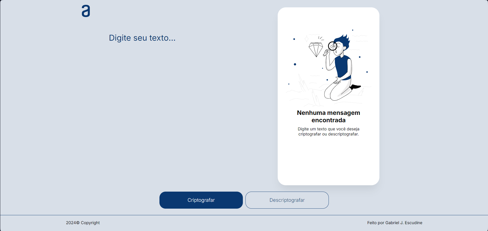

# 🔒 Message Encryption and Decryption

This is a simple project for encrypting and decrypting messages. 
It allows the user to encrypt texts using a basic encryption algorithm and then decrypt them back to their original format.

## 📚 Overview
The project was created for educational purposes, aiming to demonstrate how basic encryption works. With a simple interface, the user can input a message, apply encryption, and then decrypt it using the correct key.
 
 
You can access the project through this link: [Encryption/Decryption - Site](https://cryptography-project.vercel.app).

## 🛠️ Technologies Used
<ul> 
  <li>HTML5: For the basic structure of the interface;</li> 
  <li>CSS3: For the design and layout;</li> 
  <li>JavaScript: For the encryption and decryption logic.</li> 
</ul>

## 🔑 Features
<ul>
  <li>Encrypt messages: Converts the entered text into an encrypted form;</li>
  <li>Decrypt messages: Restores the original text from the encrypted message.</li>
</ul>

## 🔒 Encryption Algorithm
This project uses a simple character substitution algorithm to encrypt and decrypt messages. The user enters a phrase, and when they click the encryption button, the message is encrypted. It is also possible to decrypt this same message using the decryption button.

## 📬 Contact
Liked the project? Want to know more about me? Get in touch!

- 📧 Email: [gabrieljescudine.05@gmail.com](mailto:gabrieljescudine.05@gmail.com)
- 💼 LinkedIn: [Gabriel Joffily Escudine](https://www.linkedin.com/in/gabrieljoffilyescudine/)
