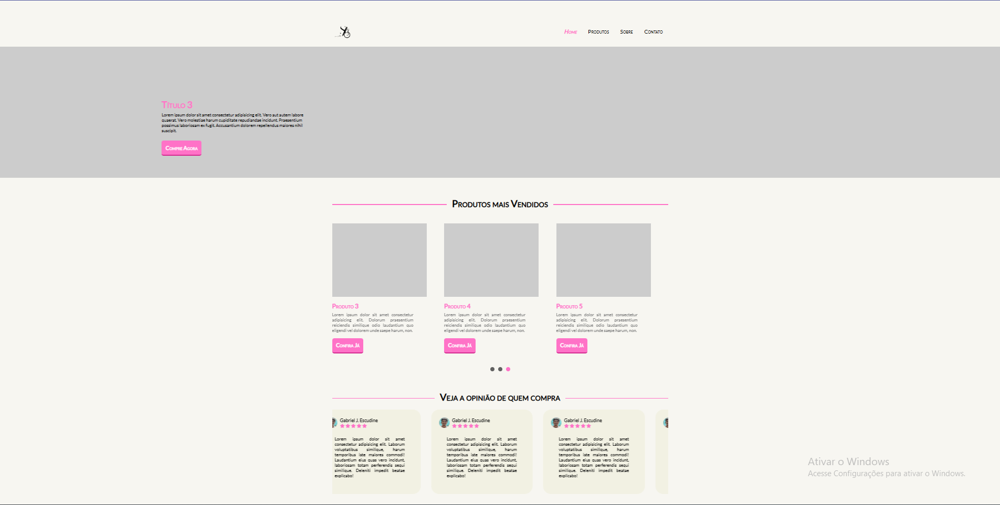

# 🔬 ScrapBook Store

## 📝 Description

This project is a website developed from scratch for an online store specializing in buttons with themes related to the healthcare field. 
From the design to the implementation, every detail was carefully thought out to create an intuitive and enjoyable shopping experience, connecting healthcare professionals and enthusiasts with unique and themed accessories.

## 💻 Technologies Used

This project was developed with the following technologies:

<ul>
  <li>HTML5: the backbone of the website, used for proper markup;</li>
  <li>CSS3: styling and responsiveness of the website;</li>
  <li>JavaScript: used for the mobile menu and some sliders;</li>
  <li>WordPress: integrated with WordPress to use plugins for back-end validation;</li>
  <li>WordPress Plugins: implemented the store system and contact forms.</li>
</ul>

## 📬 Contact

Liked the project? Want to know more about me? Get in touch!

- 📧 Email: [gabrieljescudine.05@gmail.com](mailto:gabrieljescudine.05@gmail.com)
- 💼 LinkedIn: [Gabriel Joffily Escudine](https://www.linkedin.com/in/gabrieljoffilyescudine/)
