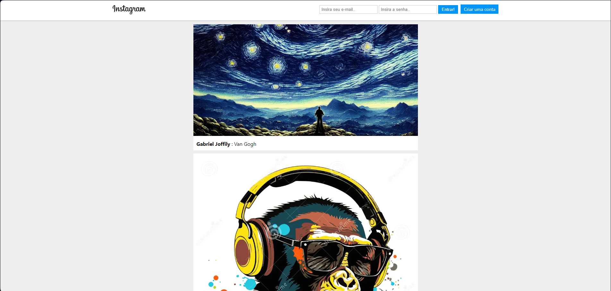

# 📱 Instagram Clone App

## 📝 Descrição

This project is a clone of the Instagram social network, created as part of the course "Complete JavaScript - Danki Code".
The goal of this project is to practice JavaScript logic alongside React. Additionally, Firebase is used for the back-end system.
 
 
You can access the project through this link: [Instagram Clone - Website](https://instagram-estudo.web.app).

## 🛠️ Technologies Used
<ul> 
  <li>HTML5: For the basic structure of the application;</li> 
  <li>CSS3: For the layout and styling, with a responsive design;</li> 
  <li>React: For building the user interface with reusable components;</li> 
  <li> Firebase: For the back-end, including: 
    <ul> 
      <li>Firebase Auth: User authentication (login/logout);</li> 
      <li>Firebase Firestore: Storage of user and post data;</li> 
      <li>Firebase Storage: Storage of images;</li> 
      <li>Firebase Hosting: Hosting the application.</li> 
    </ul> 
  </li>
</ul>

## ✨ Features
<ul>
  <li>User authentication: Registration and login with email/password via Firebase;</li>
  <li>Photo posts: Users can upload photos, which are stored in Firebase Storage;</li>
  <li>Feed of posts: Displays all posts in chronological order;</li>
  <li>Comments on posts: Users can comment on photos;</li>
  <li>Responsive design: Layout adapts to different screen sizes (mobile, tablet, and desktop).</li>
</ul>

## 📬 Contact

Liked the project? Want to know more about me? Get in touch!

- 📧 Email: [gabrieljescudine@gmail.com](mailto:gabrieljescudine@gmail.com)
- 💼 LinkedIn: [Gabriel Joffily Escudine](https://www.linkedin.com/in/gabrieljoffilyescudine/)

## 📝 License
This project was developed for educational purposes and is open-source. It is not associated with Instagram or Facebook and is available under the MIT License.