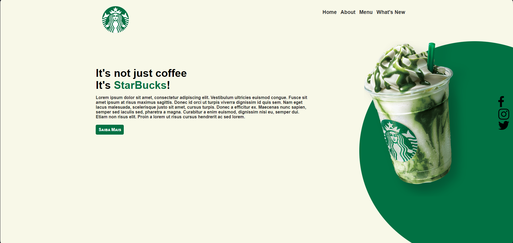

# ☕ Starbucks Landing Page

## 📝 Description
This is a simple project of a Starbucks landing page, developed using only HTML and CSS. The goal of this project was to recreate a promotional page with a clean and modern design, highlighting the brand's products and promotions.
 
 
You can access the project through this link: [Starbucks Page - Website](https://starbucks-page-sigma.vercel.app).

## 🛠️ Technologies Used
<ul>
  <li>HTML5: Used for the semantic structure of the page;</li>
  <li>CSS3: Used for the design, including layout, colors, typography, and responsiveness.</li>
</ul>

## 🎯 Project Goal
The goal of this project was to practice creating a simple landing page, exploring best practices in HTML and CSS, as well as responsive design techniques.

## 📬 Contact
Liked the project? Want to know more about me? Get in touch!

- 📧 Email: [gabrieljescudine.05@gmail.com](mailto:gabrieljescudine.05@gmail.com)
- 💼 LinkedIn: [Gabriel Joffily Escudine](https://www.linkedin.com/in/gabrieljoffilyescudine/)

## 📝 License
This project was created for educational purposes only and has no official affiliation with Starbucks.
